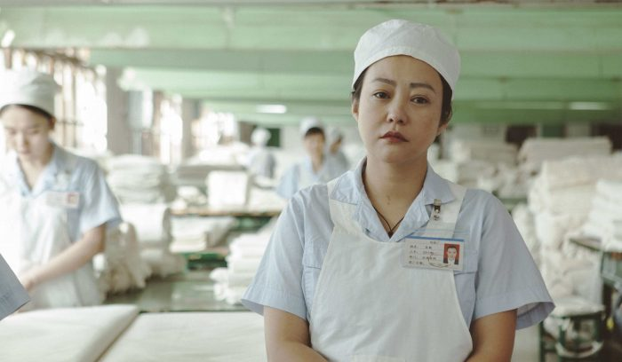
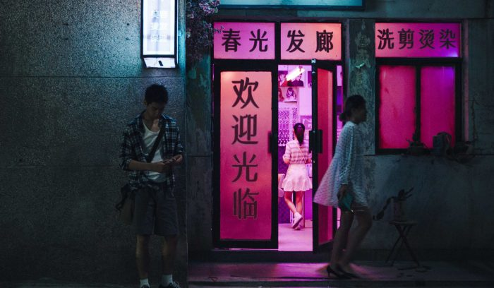

《地下美人》来了，带着一条情色热线和一个俄狄浦斯故事

---

《地下美人》的起点是2021年上海国际电影节的创投单元。那时候它叫《23号》，导演夏昊，西安人，这是他的第一部独立长片。

2025年10月，东京国际电影节亚洲未来单元，世界首映。2026年4月，北京国际电影节"注目未来"单元，拿下"最受注目艺术贡献奖"。7月，第20届FIRST青年电影展主竞赛，西宁。

郝蕾最初以监制身份加入，资方撤资后她变成出品人，走完了全流程。

---

**一、俄狄浦斯：一个站在父亲位置上的儿子**

韩烨的妈叫吴姬，郝蕾演的。

吴姬在电影里大多数时候不说话。下班，做饭，端上桌，被儿子甩脸色，把碗收了，去防空洞，接电话，用另一种声音说"很高兴为您服务"。韩烨恨她，恨的是她找了新男朋友。

韩烨的爸是一个诗人，有抑郁症，后来失踪了。有一次争吵中韩烨冲他妈吼：「你爸是诗人，他有抑郁症，你知道吗？」他妈回了一句：「是他不要我们俩。」两句台词，导演没有展开，没有闪回，让它们留在空气里。

韩烨讨厌母亲的新男友陈凯，因为陈凯出现在了他和母亲之间。他质问母亲的那些话，说出来不像一个儿子在跟母亲说话。夏昊在采访里说，那个年代大多数男孩都会有俄狄浦斯情结，父亲不在，儿子会站到父亲的位置上，母亲有了男朋友之后这种情绪会被放大。

郝蕾说，儿子会不自觉地站在父亲的位置上。影片结尾，他还是占据了那个位置。"这是很让人难过的一件事。"

**二、青春期的占有：他说"咱俩只是朋友"**

白冰是韩烨暗恋的女孩，美术班的同学，一起准备艺考。

韩烨太紧了。白冰跟别的男生走得近一点他就受不了。有一天他终于忍不住质问白冰那个男生是谁，白冰说：「你是不是对咱俩的关系有什么误解呀？」韩烨愣住了。白冰说：「什么误解？咱俩只是朋友。」

他还参加了一个画展，他老师办的，他的画也在上面。有人当着所有人的面说他的画"完全没有新意，是对抽象表现主义的空洞模仿"。他听了，没反驳。

这段我看了不太舒服。不是因为他被批评了，是他什么都说不出来。对喜欢的女孩说不出来，对批评他的人也说不出来。他唯一能说出口的地方，是一部电话。

**三、情色电话那头：一个从未露面的"地下美人"**

23号是一部电话，一个声音，一个从来没有露过面的人。

韩烨第一次拨通那个号码的时候，对方说：「您好，我是23号情感专员，很高兴为您服务。您所有的心事我都可以听听，在这里您可以畅所欲言。」

23号说：「这个世界是很热闹，但我觉得跟我没什么关系。」韩烨一定听进去了，因为他就是那个人。

23号在电话里描述自己：她穿什么颜色的衣服，她坐的沙发，她涂的指甲油，阳光怎么照在她的脸上、身上、脚踝上。她说：「我只有95斤，不过该胖的地方还是胖的。」「我坐在沙发里，半靠在椅子上，阳光洒在我的脸上……现在我的皮肤更白净了。」

画面上不是23号的脸，是一幅接一幅西方古典油画的蒙太奇。声音指导李丹枫（《地球最后的夜晚》《风中有朵雨做的云》）让这些声音有了呼吸和停顿，听着像电话那头是一个真实的人，不是在表演。

这段拍得大胆。前两次用的时候很惊艳，后面稍微有点多，但不管怎么说，它创造了一个只存在于电话线和想象力里的空间，韩烨躲进去了。

23号最后留下了一段话。她知道自己要走了：「我欺骗了你，跟你相处的这段时间很高兴，我要离开这个世界了，想想也没什么可遗憾的，希望去到一个不孤独的地方吧。你要好好的活着，你的儿子就是你的希望。」

这段话在放映厅里响起来的时候，我旁边的人在黑暗中抹了一下眼睛。

---

要说不太行的地方，韩烨这个角色确实不讨喜。他一直在生气，一直在用最伤人的话对他妈说，我看到一半有点烦他。导演没有给他任何注解，就是把他扔在镜头前，我知道这是故意的，但不妨碍我觉得烦。名画蒙太奇第一次第二次都行，后面就有点审美疲劳了。

好的地方也有。声音设计是真的好，李丹枫把电话里的声音调出了空间感，你能听出那个人在什么样的房间里说话，离话筒多远，这种细节在处女作里很少见。郝蕾的表演，她演的母亲在电影里大多数时候不说话，有一场戏镜头就停在她沉默的脸上，一整段没有台词，但你看那张脸就知道了。

这部片子从东京首映开始就伴随着两极评价。但北京国际电影节给了一个技术类奖项，说明它在声音和视觉上确实做了超出常规的事。

7月22日，我们将对话导演夏昊。如果你有想问的问题——关于那个防空洞，关于韩烨和吴姬，关于父亲的诗，关于23号，关于郝蕾的"被套牢"——可以在评论区留言，我们会一并带到采访中。

《地下美人》正在第20届FIRST青年电影展主竞赛展映。郝蕾凭此片角逐影后。

*剧照来自FIRST青年电影展官网。*