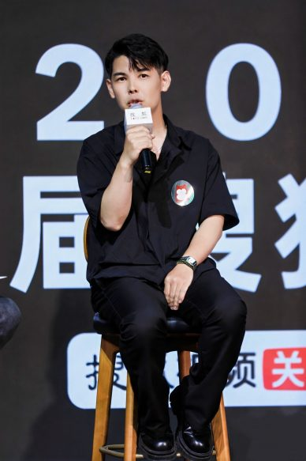
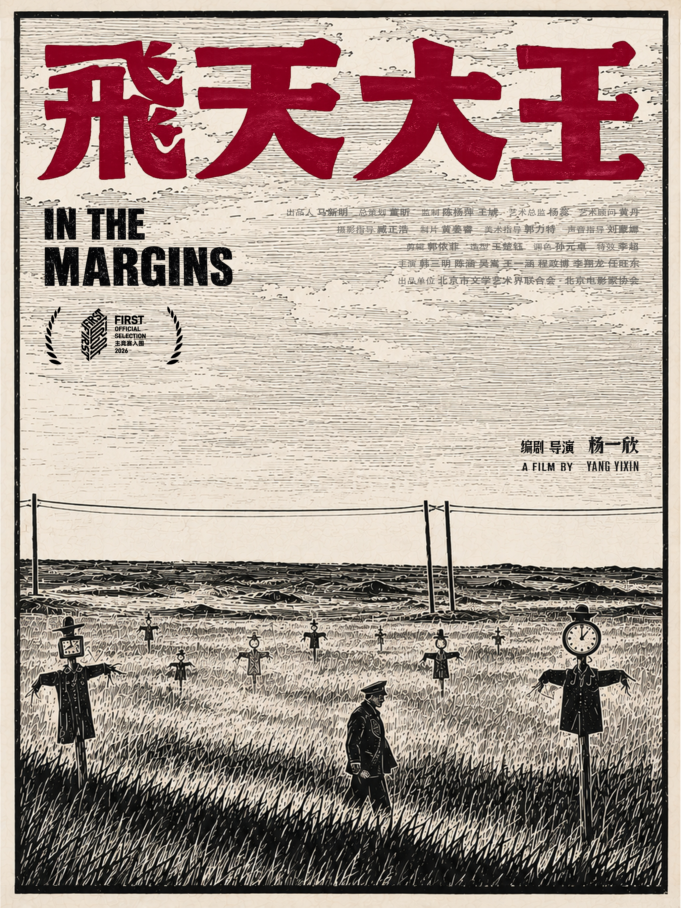
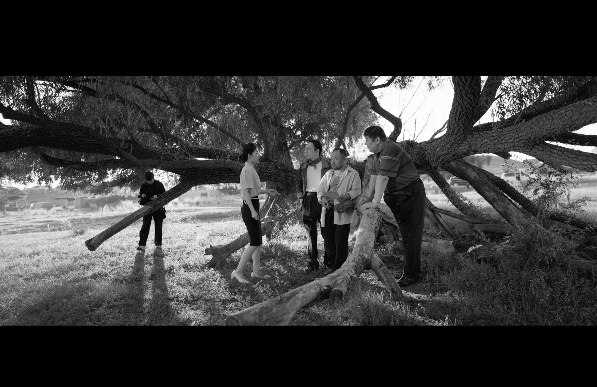
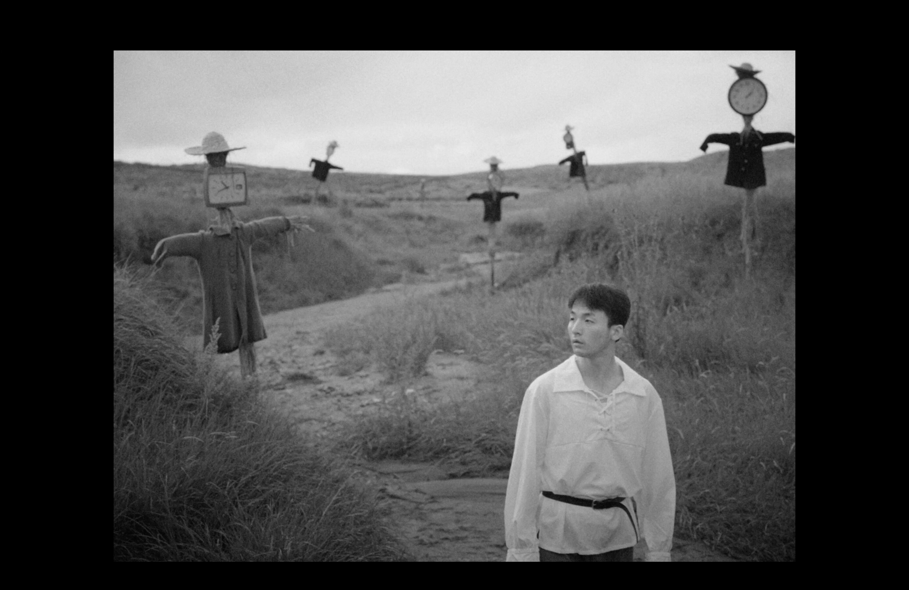
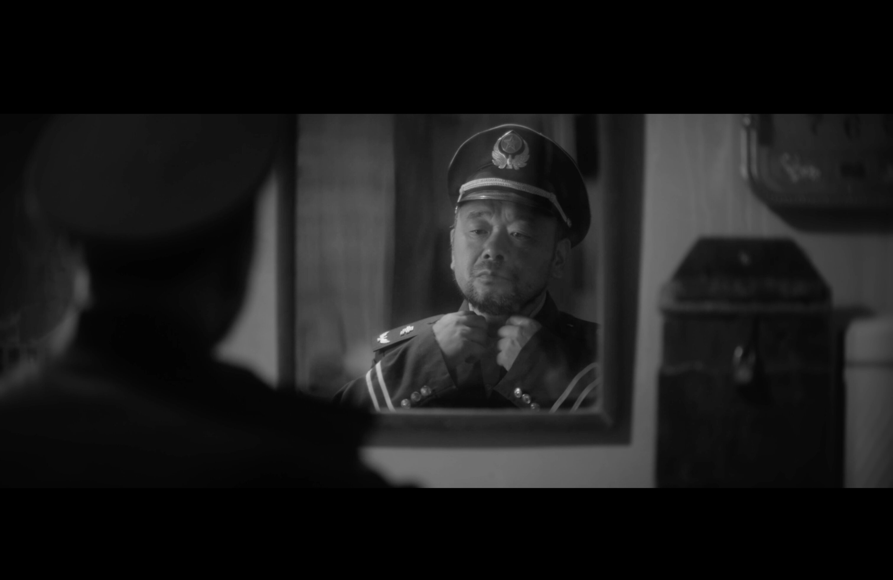
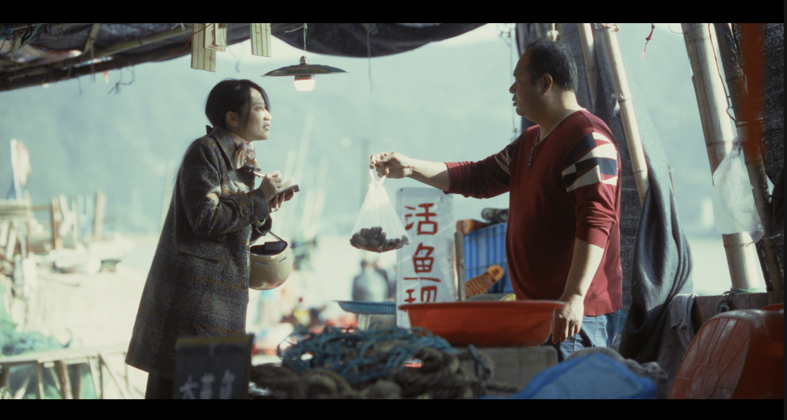
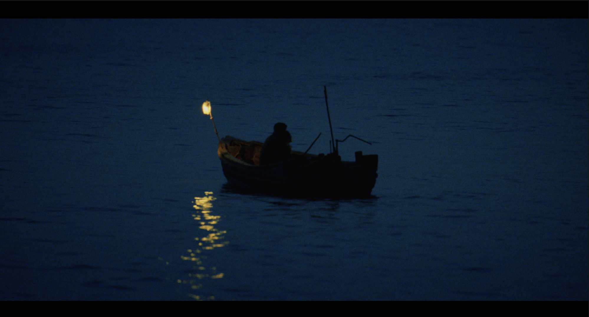
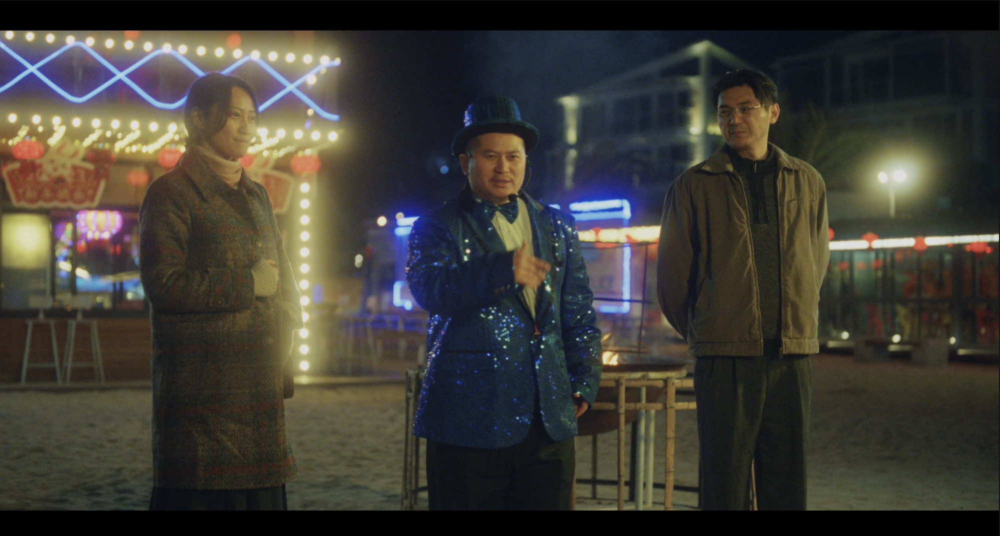

# 迟来的人 · 杨一欣短片集放映 & 交流

> 时间没有等他们，但电影记住了。

---

## 活动定位

"迟来的人"——这是这次策展的主题，也是杨一欣两部短片共享的底色。

《智齿》里，邱绿娟年近四十，从未谈过恋爱。她每天重复着相同的家务，内心却单纯地停留在过去。她嘴里的智齿，不在青春期萌芽，而在生命走过大半时才开始作痛——她的成长迟到了，她的爱情迟到了，连疼痛都是迟到的。

《飞天大王》里，退休邮递员邱瑞全被镇邮电所拉回四十年前，为一部宣传片重演自己抓逃犯的"英雄事迹"。他拼命回忆，却只记得麦田的风、脚底的路、那些说不清道不明的细碎感受——他的人生情节迟到了四十年，才被一部荒诞的宣传片重新翻出来。

一个是被家庭落下的女人，一个是被时间落下的男人。他们不是不够努力，只是落在了时间后面。

本次放映，我们看两部片子，听导演聊聊他为什么拍"迟来的人"，也和成都的短片创作者坐下来，聊聊我们各自镜头里那些迟到的人。

---

## 策展人推荐 · 为什么是"迟来的人"

> 这次邀请杨一欣来成都做放映，其实是从一笔"欠账"开始的。
>
> 2026年FIRST，我在西宁看了《飞天大王》。那是我在整个影展（长短片全部算上）唯一一部给了五星评价的片子。所有场次里，放映过程中有大笑和掌声的片子，观众喜不喜欢，坐在影厅里就能感受到。而且导演对剧本的熟悉度和理解，在所有映后里都是上乘。关于"飞天大王"这个名字，我后来想——它说的是那些我们身边宏大但无法捕捉的事物，它影响着世界，但我们抓不住它。
>
> 看完《飞天大王》我追着导演问：你之前还有作品吗？于是在青海西宁又看了《智齿》。演员表演很真实，笨拙又真诚，像是导演递出的第二张名片。夜色下借助灯光看牙的那场戏，视觉影调很有电影氛围，女主的人物塑造也很棒。
>
> 为这场放映取名时，我反复想这两部片子到底在拍什么。不是英雄，不是边缘奇观，是"迟来的人"——退休邮递员迟到了四十年才被翻出记忆，女保姆迟到了大半生才开始成长，连智齿都等到四十岁才开始疼。他们不是不够努力，只是落在了时间后面。时间没有等他们，但电影记住了。
>
> 所以这次在24帧做这场放映，不只是放两部片子。我想让成都的观众看看，一个90后导演怎么拍"迟来的人"；也想让成都的短片创作者过来坐坐，聊聊我们各自镜头里那些迟到的人。
>
> **—— 24FRAMES 策展人**

---

## 导演 · 杨一欣

**杨一欣**，浙江温州人。青年导演、编剧，北京电影家协会会员，北京电影学院文学系博士研究生在读。

导演作品入围罗德岛国际电影节、FIRST青年电影展、北京国际电影节、北京大学生电影节、86358贾家庄短片周、IM两岸青年影展、国际学生影视作品展（ISFVF）等国内外几十种电影节展。

**主要奖项：**

- 2025年第十五届北京国际电影节短片单元「最佳短片」+「最佳导演奖」
- 2024年北纬30°短片周「年度编剧」
- 第八届沈阳青年影像节「最佳剧情片」
- 伦敦环球电影节「最佳短片」
- 编剧作品获第十六届中宣部"五个一工程"奖、江苏省"五个一工程"奖

曾担任第七届海南岛国际电影节AIGC单元初审评委、第33届北京大学生电影节初审评委。

---

## 影片介绍

### ❶ 《飞天大王》| IN THE MARGINS

| 项目 | 信息 |
|------|------|
| 类型 | 剧情短片 · 黑白 |
| 年份 | 2026 |
| 导演/编剧 | 杨一欣 |
| 主演 | 韩三明、陈涵、吴嵩 |
| 入围 | 2026年FIRST青年电影展 主竞赛单元 |
| 出品 | 北京市文联、北京电影家协会 |

**故事梗概**

一个北方小镇上，退休的邮递员邱瑞全夜夜难眠。镇邮电所为了参评省级英模，计划把他四十年前抓过一名逃犯的事迹拍成宣传片。邱瑞全被拉回记忆里，却发现那些真正留在脑子里的，不是"情节"，而是生活的毛边——麦田的风、脚底的路、那些说不清道不明的细碎感受。

摄制组夸夸其谈，孟所长满口官腔，村民们频频捣乱……当这场宣传片拍摄越来越滑稽混乱时，一个名叫"飞天大王"的国际连环杀人犯的脚印，悄然出现在了小镇上。

**迟来在哪里**

邱瑞全的人生，被一部迟到了四十年的宣传片重新翻出来。但他记得的不是当年抓逃犯的英勇——是麦田，是风，是那些被"英雄叙事"忽略的日常。他的记忆迟到了，才看清自己真正在乎的东西。

**导演阐述**

> 谢晋导演曾说："拍电影就像手心捧水，走得越远，漏得越多。"那我们的生命也是如此吗？当人生愈加朝前走去之时，我们究竟留下的更多，还是遗漏的更多？
>
> 我构想了一个"没有情节"的人物邱瑞全——邮电所想拍摄他四十年前做过的一件好人好事用以完成政绩，但他的记忆回溯不仅无力，且同现实对"情节"与"奇观"的需求分外割裂：对一个普通个体而言，究竟重要的是生命中的"情节"，还是生活的"毛边"？而他又该如何从这些看似冗余的"毛边"中，寻找到自己存在过的意义与尊严呢？

**剧照**

*邱瑞全被拉回四十年前的记忆——老树还记得，但他快忘了*

*虚构与现实的边界，在荒诞中模糊——时间在这座小镇上，变成了一个笑话*

*一个退休邮递员的人生，被一部迟到了四十年的宣传片重新翻出来*

---

### ❷ 《智齿》| WISDOM TOOTH

| 项目 | 信息 |
|------|------|
| 类型 | 剧情短片 · 彩色 |
| 年份 | 2023（北京电影学院艺术硕士学位作品） |
| 导演/编剧 | 杨一欣 |
| 主演 | 潘若瑶、王大虹 |
| 艺术总监 | 黄丹 |

**故事梗概**

邱绿娟在一个数学老师家当保姆，每天处理数十名小学生的饮食起居。她年近四十，没有什么恋爱经历，远在乡村的父母始终对她抱有愤怒，把她当作提供钱财的工具。

最近她发现自己的牙齿有些疼痛，诊断结果是智齿发炎。在这次诊断后，温柔热情的牙医许大苇闯入了她的生活——教她跳广场舞，陪伴她度过美妙的每时每分。

但一次偶然，似乎又将吹起的美梦戳破。

**迟来在哪里**

邱绿娟的人生，什么都迟到了。智齿四十岁才发炎，初恋四十岁才萌芽，连成长都迟到了大半生。她嘴里的那颗智齿，疼得刚刚好——因为它提醒她，有些东西虽然迟到，但还来得及疼。

**导演阐述**

> 当你回溯生命的大半过往，却发现自己始终以来的生活不仅刻板重复，你该怎么面对接下去的人生呢？
>
> 邱绿娟是一个年近四十、从未有过恋爱经历的保姆，她每天重复着相同的工作，内心却单纯地停留在过去。她就像自己嘴中那颗疼痛的智齿——迟缓于这个向前涌动的世界，它并不在青春期萌芽，而在生命走过大半时才开始作痛。
>
> 当一个个体发现自己的人生始终平静无波时，那对自己生命历史的回溯和考察，是否仍具有其价值和意义？这些个体又该如何在"丧失情节"的生活里，寻找到属于自己的那美妙的每时每分呢？

**剧照**

*邱绿娟的生活，被日常填满——像这个水产市场，新鲜、潮湿、透不过气*

*深蓝的水面上只有那一盏灯——像许大苇突然闯进她的生活，是黑暗里唯一的暖色*

*生活里总有不合时宜的亮色——就像迟来的爱情，在荒诞的夜晚登场*

---

## 活动流程

### ① 短片放映 · 约60min

**《飞天大王》**（约25min）→ 中场休息5min → **《智齿》**（约30min）

先看一个迟到的男人，再看一个迟到的女人。从荒诞的黑色幽默，到温情的日常疼痛，情绪上升。

### ② 映后谈 · 约40min

杨一欣现场连线/到场，与观众交流：

- **创作原点**：为什么总是拍"迟来的人"？邮递员、女保姆——这些人在你生活中是什么位置？
- **双片对照**：《飞天大王》和《智齿》都涉及"回溯"与"记忆"，两部片子之间有什么隐秘的对话？
- **从学院到影展**：从北电硕士作品到FIRST主竞赛，这条路怎么走？
- **观众Q&A**

### ③ 短片创作者交流 · 约50min

邀请成都本地短片创作者到场，围绕以下议题自由交流：

- **"迟来的人"创作谈**：你的短片里，有没有那些迟到的人？
- **短片生态**：在成都做短片，找到过什么支持？又缺什么？
- **未来可能**：有没有想过合作？联合创作？

开放式交流环节，不设固定座位，大家可以自由走动、换组聊天。

---

## 活动信息

| 项目 | 内容 |
|------|------|
| 时间 | **2026.8.16（周日）14:00** |
| 主题 | **迟来的人 · 杨一欣短片集放映 & 交流** |
| 片目 | 《飞天大王》+《智齿》 |
| 环节 | 放映 → 映后谈（杨一欣）→ 创作者交流 |
| 总时长 | 约150分钟（含休息） |
| 地点 | 太古里方所书店（待确认） |
| 票价 | 免费 |
| 报名 | 待开放 |

---

## 待办

- [x] 确认档期 → **8.16 14:00**
- [x] 确认活动主题 → **迟来的人**
- [ ] 确认场地（太古里方所）
- [ ] 联系杨一欣确认参与方式
- [ ] 邀请成都本地短片创作者（名单待定）
- [ ] 确认票价（免费）
- [ ] 制作活动海报
- [ ] 发布推文 + 开放报名

---

*策划：24FRAMES / 2026.08.12*