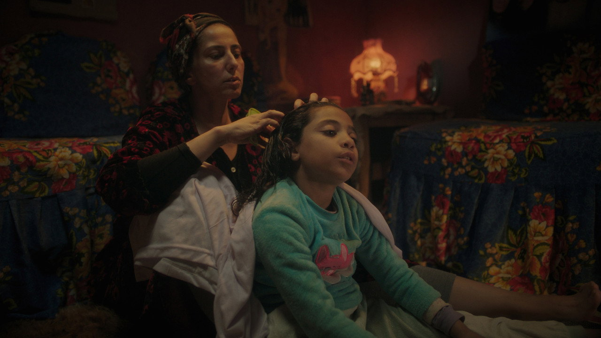
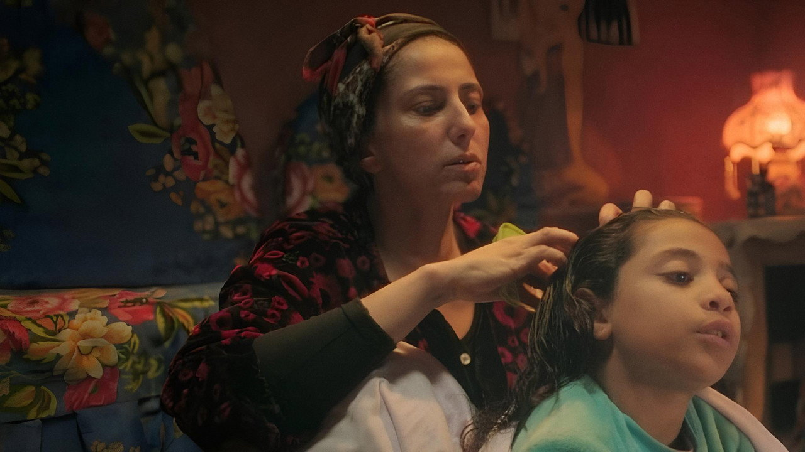
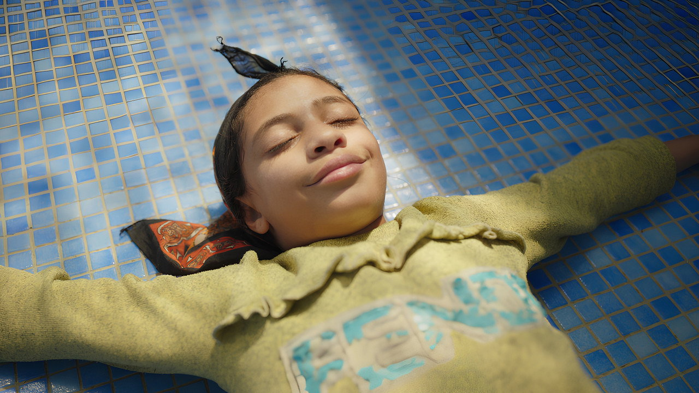
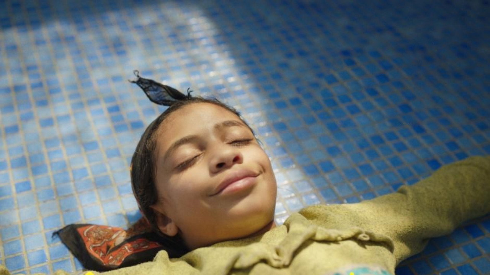

# 她没有自己的蜡烛

> **剧透预警**：本文涉及《生日快乐》的核心情节与结局。介意请先观影。

*《生日快乐》(عيد ميلاد سعيد / Happy Birthday, 2025) 官方海报*

---

## 一、一个不成立的片名

"生日快乐"。

这大概是世界上最常见的祝福语之一。你听到它的时候，通常意味着有人在庆祝你。有人为你点了一根蜡烛，有人希望你许愿，有人希望你被世界看见。

但《生日快乐》拍的，是一个永远不会收到这句话的人。

阿拉伯语原名 عيد ميلاد سعيد，拆开来看：عيد 是"节日"，ميلاد 是"出生"，سعيد 是"快乐"。字面意思是"出生节日快乐"——生日是一个节日。它是一个仪式。它的含义是"今天，全世界都停下来，承认你存在"。

但影片的主角托哈，八岁，在开罗一个富裕家庭当女仆——她没有这个节日。

她给主人的女儿奈莉过生日。买蛋糕，买气球，布置房间。她花了一整天，替另一个孩子完成了一场完美的生日派对。

然后她站在那场派对的角落里，看着蜡烛被点燃。

那不是她的蜡烛。

*《生日快乐》剧照*

---

## 二、简介没告诉你的事

官方简介说："八岁小女孩托哈在开罗一个富裕家庭当童工女仆，与雇主女儿奈莉建立特殊联系。从未庆祝过自己生日的托哈下定决心为奈莉办一场完美的生日派对，暗自希望借此体验从未感受过的快乐。"

简介很准确。但它漏了一个东西。

简介说"暗自希望借此体验从未感受过的快乐"——但简介没说这个"希望"有多绝望。它没说一个八岁的女孩，为什么要通过替别人过生日，来体验自己的快乐。它没说，这本身就是一个多么不可能的想法。

你想想：托哈想做的事，本质上是在说——"如果奈莉的生日派对足够完美，我就能分享那份快乐。"

快乐是不能分享的。

一份生日蛋糕切了八块，每块味道一样。但蜡烛只能为你一个人点。蜡烛上的火苗是为你亮的。你许愿的时候，全世界都在等你吹灭它。这些都不是能分给别人享受的东西。

托哈知道这个。

简介不说这个，是因为简介没法说。简介是一段两百字的文字，它没法解释一个八岁的女 serv，为什么要通过替另一个八岁的女孩过生日，来让自己感觉好一点。

但电影能。

电影用九十分钟告诉你：托哈不是不知道快乐不能分享。托哈是知道快乐不能分享，但还是试了。

这是整部电影最重的东西。

---

## 三、为什么是生日派对

一个导演可以选择用一百种方式拍一个童工的故事。

她可以拍工厂。可以拍矿洞。可以拍一个八岁女孩在流水线旁边、在矿洞深处、在某个不该出现在那里的地方。她可以拍童工的悲惨、童工的残酷、童工的不公。

但 Sarah Goher 没有。

她拍了一个生日派对。

这是整部电影最勇敢的选择。因为生日派对和童工之间，表面上没有任何关系。一个生日派对是彩色的、快乐的、属于童年的。一个童工的故事是灰色的、悲惨的、属于社会的。这两个东西不应该出现在同一部电影里。

但它们确实出现了。

一部关于童工的电影，把镜头对准了一个生日派对。它没有拍她有多苦，它拍的是她有多小。它没有拍剥削，它拍的是一个女仆替另一个女仆过生日。它没有拍不公，它拍的是一个八岁的女孩，在别人的生日派对上，偷偷写下一个属于自己的愿望。

这就是整部电影的结构：用一个不属于托哈的仪式，去呈现托哈自己的存在。

你想想这个有多聪明。

如果 Goher 拍的是一个控诉片——工厂、矿洞、血汗——你会看完，会觉得难过，然后你会发一条微博，然后你会忘掉。因为控诉片给你的是愤怒，愤怒是一种消耗品，你用完了就没了。

但 Goher 拍了一个生日派对。你看完不会愤怒。你看完会坐在那里，坐很久。因为你发现，这部电影让你想起了一个很远的、很安静的、你几乎已经忘掉了的东西——那种"我也可以被庆祝"的感觉。

一个八岁的女仆，站在一个不属于她的生日派对里。

你为什么会想起那个感觉？

因为你自己也有过一次。

---

## 四、Sarah Goher：一个制片位上看了十年的人

现在说说拍这部片子的人。

据公开资料，Sarah Goher 是埃及裔美国人，长在纽约布朗克斯，NYU Tisch 电影学院毕业。在写《生日快乐》之前，她做的是制片——不是导演，是站在片场边上的人。

她做过《678路公交车》（Cairo 678, 2010）的总制片人。那是关于开罗一辆公交车上不同阶级的人的故事。她做过 Mohamed Diab 的《碰撞》（Clash, 2016）的总制片人——那部电影讲一辆小巴意外拉上了不同社会阶层的人，开回开罗，一整天之内所有人互相撕开。她还做过《Amira》（2021）和漫威《月光骑士》（Moon Knight, 2022）的制片。

然后她做了自己的长片首作：《生日快乐》。

你注意她的履历——她过去十年做的几乎每一部片子，都在讲同一件事：开罗的阶级。《678》是公交车上的阶级，《碰撞》是小巴里的阶级，《生日快乐》是一个女仆和雇主的阶级。

她站在制片的位置上，看了十年。然后她终于拿起摄影机，拍了一个八岁的女仆。

这次和她合作的编剧 Mohamed Diab——就是《碰撞》的导演。他写了《生日快乐》，同时做了执行制片。

一个人的路径是这样的：2010年，她在《678》的片场当制片人，看见公交车上的阶级。2016年，她在《碰撞》的片场当制片人，看见小巴里的阶级。2025年，她拿起摄影机，拍了一个八岁女孩站在生日蛋糕前面。

十年。三部片子。同一个阶级。从"制片位上看见"到"拿摄影机拍"。

你想想这件事有多难。一个制片人有十年时间看同样的问题，然后她终于决定自己拍。她没有把它拍成控诉——她拍成了一个生日派对。一个八岁女孩，一个愿望，一根不为自己点的蜡烛。

这是克制。这不是不会拍控诉片。这是看见了十年之后，选择不拍控诉片。

《碰撞》是一辆车里的人互相撕开。《生日快乐》是一个女仆在别人的生日派对上写了一个愿望。两部片子讲同一个阶级——但一个拍了撕开，一个写了句子。

---

## 五、八岁小孩的眼睛

然后是 Doha Ramadan。

Variety 说她"从八岁小孩身上逼出了惊人的深度"。Screen International 说这部片"演出敏感"。The Contending 给了 B+，说她在这个角色里是"绝对的奇迹"，"不像多数童星那样用力过猛，她有一张表情极其丰富的脸，她不会被任何人糊弄"。

我同意。

托哈这个角色的难处在于：她不能哭，不能喊，不能演。一个八岁的女仆，要演的不是"我很惨"，是"我早就知道了"。

八岁的小孩，如果真的"早就知道了"，她不会哭。她会站在蜡烛前面，停一下，然后走开。

Doha Ramadan 没有演哭，没有演喊，没有演"我有多惨"。她演的是"我知道"。

这是最难的东西。一个八岁的小孩的眼睛里，装着一整个她已经放弃的期待。

一个真正放弃过的小孩，不会表演放弃。她已经不需要表演了。因为她早就知道了。她只需要站在那里。

Variety 说 Sarah Goher"逼出了"这个表演。但我觉得用词不对——不是"逼"，是"等"。Sarah Goher 在片场等了她。她什么都没做，就让这个八岁的小孩站在那里，然后拍了下去。

一部电影最难的表演，往往不是那个最激烈的瞬间，而是那个最安静的瞬间。

---

## 六、一个八岁的女仆

现在说说文化背景。

埃及的童工问题不是秘密。联合国儿童基金会和埃及政府合作了多年的项目，但数据一直不好看。世界银行2022年的报告显示，埃及约9%的儿童在劳动——大约270万到310万儿童。但真正需要知道的不是这些数字。

你真正需要知道的是一件更小的事：在一个富裕家庭里，雇一个八岁的女孩当女仆，在开罗，在2025年，是完全正常的。

这不是什么地下交易。这不是什么秘密。这是社会结构的一部分。

开罗的阶级是分层的。最上面是富人区——Zamalek，Heliopolis，Maadi。这些地方的房子有花园，有游泳池，有佣人。再往下一层是中产——他们有自己的公寓，有自己的车，但他们的孩子在课外补习班上度过整个周末。再往下——是工人阶级，是司机，是修理工，是那些在开罗的炎热里，做着各种各样看不到头的工作的人。

而在所有这些层级之间，有一个你几乎看不见的层：仆人。

不是那种在电视剧里端茶的仆人。是真的仆人。那种你叫不出名字的、你从来不会和他说超过一句话的、他的孩子可能就在你家的厨房里帮你切菜的仆人。

托哈就在这个层里。

她不是"童工"这个词能涵盖的。"童工"这个词是西方的，是劳工运动发明的，是用来形容工厂里八岁孩子的。托哈不在工厂里。托哈在一个漂亮房子的厨房里，给一个漂亮的小女孩过生日。

这就是为什么《生日快乐》不能拍成控诉片。因为控诉片需要"工厂"，需要"血汗"，需要"不公"。但托哈的不公不在这些地方。托哈的不公在一个生日派对里——在一个彩色的、快乐的、属于别人的、她没有份的生日派对里。

---

## 七、蛋糕店里的那个瞬间

电影里有一个很小的场景。托哈走在开罗的街上。她买零食。

这个场景很小。小到你几乎不会注意。

但我想多说两句。

托哈走在街上。街上有人，有摊子，有声音。她买了零食，拎在手里。

这个瞬间的重量在于：这是托哈唯一完全属于自己的时刻。

在家里，她是女仆。在雇主家的房间里，她是可以被允许的客人。但在街上——在这个短暂的、几分钟的瞬间里——她就是一个普通的小孩。手里拿着零食，走在开罗的街上。

你想想一个八岁的女孩，在街上走了几米路，买了零食——然后她回到那个漂亮房子，继续替另一个八岁的女孩过生日。

这几米路，是托哈一天里唯一属于自己的路。

*《生日快乐》剧照*

---

## 八、两个八岁的女孩

托哈和奈莉之间，有一种很特殊的联系。

奈莉是雇主的女儿。托哈是仆人。一个八岁，一个也是八岁。她们之间隔着一整条阶级线——但她们也是同龄人。

奈莉过生日。托哈替她准备了这场生日。奈莉站在蛋糕前面吹蜡烛。托哈站在边上看着。

你想想这两个八岁女孩之间的那几米距离。

奈莉是这场生日的主角。托哈是这场生日的执行者。奈莉被全世界庆祝，托哈被自己用一句话庆祝。

但她们也是同龄人。一个八岁的女孩看着另一个八岁的女孩过生日。她知道那是什么感觉——不是因为她也过过生日，而是因为她知道，那个感觉不是她的。

这就是托哈和奈莉之间最复杂的东西。不是友谊，不是同情，不是嫉妒。是一种很安静的平行——一个在过，一个在旁边看着，知道那不是自己的。

奈莉吹蜡烛的那一刻，托哈也在。但奈莉许的是奈莉的愿望。托哈许的是自己的。

同一根蜡烛，两个愿望。

---

## 九、母亲的角色

奈莉的母亲莱拉，对托哈好。

"好"是什么？一个妈妈，对一个女仆的孩子，好到什么程度算好？

她可以让托哈站在自己女儿的生日派对上。她可以让托哈吃一块蛋糕。她可以和托哈说话，可以笑，可以表现出一种超出雇主-仆人关系的热络。

但莱拉给不了托哈一个生日。

简介里说，托哈和莱拉的关系"逐渐超越了雇主与仆人的界限"，"根深蒂固的社会等级制度受到威胁"。

你注意这几个字：**受到威胁**。

不是"被挑战"，不是"被打破"——是"受到威胁"。

一个妈妈对一个女仆孩子好，这件事本身就在威胁等级制度。因为它意味着：也许这个孩子不只是仆人。也许她也是孩子。

但"也许"这个词就够了。"也许"意味着还没到。意味着莱拉可以对托哈好，但不能把托哈当成奈莉。

一个八岁的女仆，被一个好心的雇主母亲允许吃一块蛋糕，被允许站在生日派对上——但她不被允许有一个生日。

这就是"好"和"平等"之间的距离。

---

## 十、这部电影没有拍的事

有一件事我想说。

《生日快乐》没有拍童工。

它没有拍工厂，没有拍矿洞，没有拍血汗。它没有拍一个八岁女孩在流水线旁边、在矿洞深处、在某个不该出现在那里的地方。

它拍的是蛋糕。它拍的是气球。它拍的是一个女仆替另一个女仆过生日。

这是整部电影最勇敢的选择。

一个拍阶级、拍童工的电影，可以很容易地走向控诉。它可以拍一个女孩在工厂里干活，拍她的黑眼圈，拍她瘦削的手，拍她被欺负。这是正常的做法。每一部关于童工的电影都可以这么做。

但 Goher 没有。她拍了一个生日派对。

一个没有拍童工的电影，反而让你更清楚地看见了童工。因为它把镜头对准了童工不应该被看见的那些东西——一个生日，一个愿望，一根蜡烛。

它没有拍她有多苦。它拍了她有多小。

一个八岁的女孩，站在蛋糕前面，停了一瞬。

这就是全部。

而且它还做了一件事更厉害的事：它让你自己去补全那些它没有拍的东西。

它没有拍工厂，但你看见了工厂。它没有拍血汗，但你看见了血汗。它没有拍那个父亲溺死的时候，但你知道了。它没有拍那个稻草人是怎么变成稻草人的，但你看见了田里的风。

这就是电影最厉害的地方。它不需要拍完所有的事。它只需要拍一个蛋糕，然后你自己在心里把剩下的东西填完。

一个八岁的女仆，在一个生日派对里，用一支笔写了一句话——这就是全部的暴力。你不需要看到工厂。你不需要看到血汗。你只需要看见这个八岁的女孩，用一支笔写了一句话，就足够了。

这就是全部。

一部电影可以不拍任何东西，但让你看见一切。《生日快乐》没有拍童工，但它拍了一个童工最不该被看见的脆弱——她没有生日。

---

## 十一、国外影评人：100% 之后

烂番茄 100%，十六篇。几乎全好评。

共识是两条：第一，Sarah Goher 克制，敏感，不煽情不控诉。第二，Doha Ramadan 的表演是绝对的亮点。

Variety 说她"展现了一种罕见的情感控制力"，"从 Doha Ramadan 身上逼出了一个惊人深度的表演"。Screen International 说这是一部"动人且演出敏感的当代埃及童工与阶级分化的呈现"。The Contending 给了 B+，说 Ramadan 是"绝对的奇迹"。

但也有分歧。Loud and Clear 给了 3.5/5，说"Ramaday 出色的主演表演救下了这个笨拙的阶级叙事"。New Indian Express 说"这部电影是一个直白、简单、常常可预测的叙事"。

这两家说的是同一件事：**阶级叙事太笨拙了。**

我不同意。

"笨拙"是一个西方影评人对第三世界阶级片常用的说法——他们期待的不是"控诉"，他们期待的是"精致"。可这部片子不是控诉片。它是一部甜品电影。它没有要"精致地控诉"什么。它只是把几个画面放在那里：一个女仆买了蛋糕，替另一个女仆过生日，在一个不属于她的派对上，写了一个属于自己的愿望。

"笨拙"这个词，适合那些把阶级拍成纪录片、拍成控诉、拍成数据条的电影。它不适合一个导演把镜头对准一个八岁小孩，只拍她站在蛋糕前面的一秒。

如果你说这部片"可预测"——那你大概期待它走向别的地方。可它没有。它走向了"她没有吹灭蜡烛"。

一部片的"可预测"和"不可预测"，取决于你想要什么。如果你想要一个奇迹——一个女仆变成了雇主的家人，一个愿望实现了——那你觉得它可预测，因为它没有给你奇迹。

如果你想要的只是一个八岁女孩站在蛋糕前面的样子——那你可能觉得它不可预测，因为你没想过一个电影会把那个瞬间拍下来。

---

## 十二、国内：8.8 分

豆瓣 8.8。在展映片里，这是一个相当高的分数。

中文观众的短评印证了核心：一条短评说，"孩子的视角讲阶级叙事，许愿在一个小大人那里有无限的吸引力……最终终于在蜡烛熄灭的那一刻，梦碎心"——它说"蜡烛熄灭"，其实没有熄灭。托哈没有吹灭它。

另一条短评说："乍一看简介，可能很多人把它当成温情故事：穷孩子富孩子纯真跨越阶级。可影片的实际走向，偏偏与这份想象截然不同。"

对。这就是这部片子的地方。它不像简介那样，它是一部甜品电影，但你越吃越觉得有一根刺。

还有一条："看完发现果然是女导演……以孩子视角拍的片子，要么特别温情，要么特别残酷，这部显然是后者。"

我觉得这条说得对。但我要补充一句：它不是"残酷"。它是"清楚"。它只是把一件事摆出来：一个八岁的小孩，在别人的生日上，替自己过了一个生日。然后她没有吹蜡烛。

这部片的走法也很有意思。2025年6月 Tribeca 首映，9月埃及公映。然后是美国 Mill Valley、Heartland，巴西圣保罗，东京，布里斯班，英国 Hebden Bridge。2026年4月北影节，6月上影节，8月韩国阿拉伯电影节，9月丝绸之路国际电影节——9月18日在中国做了点映，10月23日公映。

十四档上映记录，八个国家。

但 TMDB 上只有一项提名——第16届好莱坞音乐媒体奖的"外语独立电影原创配乐"，给的是作曲家 Mina Samy。没有拿到主要奖项。

一部长片首作，走了一整年的影展，零奖杯。但烂番茄 100%，豆瓣 8.8。

这大概是独立电影最普通的走法：没有奖杯，但有人看，有人记住了。

---

## 十三、蜡烛熄灭的那一刻

整部电影最重要的一个动作，出现在结尾。

轮到托哈过生日了。她站在自己的蛋糕前面，停了一瞬——然后她没有吹。

豆瓣有一条短评写得很精准："最终终于在蜡烛熄灭的那一刻，梦碎心。"

这条短评说错了。蜡烛没有熄灭。是托哈没有吹灭它。

但这条短评比大多数评论都更接近了这部电影的核心。因为"蜡烛熄灭的那一刻"——那正是托哈决定"不吹"的那一刻。

**一个八岁的孩子，为什么不吹蜡烛？**

因为许愿改变不了什么。

托哈早就知道了。她知道许愿不能让爸爸回来。不能让爸爸从田里的稻草人变回一个活人，重新走进这个家，重新叫她一声。不能让她的生日从这个家里浮现出来。不能让莱拉看她的眼神，从"女仆"变成"孩子"。

**许愿，不就是想改变那些我们自己都无法控制的事情吗？**

一个八岁的小孩，比大人都更早接受了这件事。她知道那些愿望，一个都不会实现。所以她没吹。不是不想过生日——是她已经知道了。

一个八岁的孩子，站在自己的蜡烛前面，选择不去吹灭它。因为吹灭就意味着许愿，许愿就意味着期待，期待就意味着要失望。而她不愿意。她已经不需要了。

这不是一种坚强。这是一种提前到来的放弃。

一个八岁的小孩，在生日那天，放弃了许愿的权利。

你想想这意味着什么。吹蜡烛是一个仪式——你闭上眼睛，你许愿，你吹灭它，然后蜡烛灭了，愿望被送出去了。整个仪式都在告诉你：愿望有可能实现。

托哈拒绝了这个仪式。

她不是不信愿望能实现。她知道愿望不可能实现。所以她拒绝了这个让她产生期待的仪式。

一个八岁的孩子，用"不吹蜡烛"的方式，把自己保护起来了。

*《生日快乐》剧照*

这比哭比喊比控诉都重。一个大人不会这样。一个大人会吹灭蜡烛，然后假装什么都不知道。一个八岁的孩子不会。她已经知道了。

---

## 十四、一个父亲的消失

一个八岁的女孩，失去了她的父亲。

电影没有用多少篇幅来拍这件事。没有葬礼，没有大哭，没有回忆。电影只是让一个稻草人站在田里，然后让托哈看见他。

这是整部电影最克制的处理之一。

一个八岁的女孩失去了父亲。正常来说，一部电影会拍她大哭、拍她喊爸爸、拍她追着妈妈要爸爸。但《生日快乐》没有。它只是把一个稻草人放在那里。

因为对一个八岁的孩子来说，失去父亲不是一次事件。失去父亲是一个状态。你不需要大哭一次。你只需要每天经过那个稻草人的时候，看见它，然后知道那不是你的爸爸，但又知道那是你的爸爸。

这个"知道"每天都在发生。它不是一次性的事件，它是一个持续的、安静的、每天都在发生的丧失。

电影没有拍这个丧失。电影只是让这个稻草人站在那里。然后它让你自己去感受。

一个稻草人站在田里。风一吹，它晃一下。

*《生日快乐》剧照*

这就是一个八岁的女孩每天都在看见的东西。

---

## 十五、为什么是生日

一部电影可以讲一个没有父亲的女孩。可以讲一个童工。可以讲阶级。但 Sarah Goher 选择了一个入口：**生日**。

为什么是生日？

因为生日是最基本的仪式。生日的意思是：今天，你被这个世界承认了一次。今天是你的节日，全世界都该停下来看你一眼。

一个没有生日的人，等于一个没有被世界承认过的人。

如果 Goher 拍的是一个没有父亲的父亲故事，那它就是一个关于丧失的电影。如果她拍的是一个童工的童工故事，那它就是一个关于劳动的电影。如果她拍的是一个阶级故事的阶级故事，那它就是一个关于分层的电影。

但她拍的是一个生日故事。

一个没有生日的人，在一个有生日的人的生日上，写了一个属于自己的愿望，把那个愿望当成了自己的生日。

然后她没有吹蜡烛。

这个结构太精巧了。它把一个复杂的社会问题——童工、阶级、父爱缺失——压缩进了一个最小的仪式里。这个仪式小到什么程度？小到一支笔，一张纸，一句话，一根蜡烛。

但就是在这个最小的仪式里，所有的重量都在。

你想想：为什么Goher选了生日，而不是婚礼？为什么不是葬礼？为什么不是开学？为什么不是毕业？

因为生日是最纯粹的仪式。婚礼是两个人的事。葬礼是所有人的事。开学是学校的事。毕业是未来的事。

但生日只是你自己的事。今天，全世界停下来，承认你存在。今天，你是主角。今天，你是被祝福的那个人。

托哈连这个都没有。

一个连生日都没有的人，怎么可能有婚礼？怎么可能有葬礼（她还没到要别人的时候）？怎么可能有开学？怎么可能有毕业？

她连最基本的"被承认"都没有。

这就是为什么Goher选了生日。因为生日是一个你无法再简化了的仪式。它不能再小了。它就是一个蜡烛，一个愿望，一个"今天你被看见"的瞬间。

托哈把这个最小的仪式，偷了。

她站在别人的生日派对上，用一支笔，偷了一个属于她自己的瞬间。

这不是偷。这是借。

她借了一句话，当成了自己的生日。

---

## 十六、世界上最普遍的一句话

"生日快乐"是世界上最普遍的一句话。

你出生，有人跟你说生日快乐。你长大，有人跟你说生日快乐。你结婚，有人跟你说生日快乐。你生孩子，有人跟你说生日快乐。

它是一个你永远不会拒绝的短语。因为没有人会拒绝"生日快乐"。

但《生日快乐》拍了一个不会收到这句话的人。

一个八岁的女孩，她的名字不在蛋糕上，不在横幅上，不在任何一张写着"Happy Birthday"的纸上。她的生日不存在。所以没有人跟她说"生日快乐"。

世界上最普遍的一句话，对她来说是最被拒绝的一句话。

这就是这部电影最讽刺的地方。它拍了世界上最普遍的祝福，送给了一个不会收到它的人。

一部关于"生日快乐"的电影，讲的不是一个被祝福的人。是一个没有被祝福的人。

你想想这有多讽刺。一个八岁的女孩，她的名字从来不在任何一张写着"Happy Birthday"的纸上。她的名字从来不在任何一块蛋糕上。她的名字从来不在任何一个房间里。

她的生日，甚至不存在。

但这个世界每秒钟都有人在说"生日快乐"。每秒钟都有人为别人点蜡烛。每秒钟都有人替别人吹蜡烛。每秒钟都有人许愿。

托哈站在这个世界的旁边，看着这一切发生。

然后她拿起一支笔，在别人的生日上，写了一个属于她自己的句子。

一个句子，偷了一个生日。

---

## 十七、那支笔

电影里有一个很小的道具。一支笔。

托哈用这支笔，在奈莉的生日上，写了一个愿望。

这支笔很小。小到几乎不会被注意到。

但它是整部电影里最重的道具。

因为这支笔是托哈唯一拥有的工具。她拥有一支笔，一张纸，一句话。这就是她全部的自我表达方式。

她不能说话——她不能在这个家里说"我想要一个生日"。她不能要求——她不能要求任何人替她点一根蜡烛。她不能存在——她不能站在这个房间的中间，让所有人看见她。

她只有一支笔。

一支笔，一张纸，一句话。

她用这支笔，在别人的生日上，写了一个属于她自己的句子。然后她把这句话当成了自己的生日。

这就是托哈全部的反抗。一支笔。

一个八岁的女仆，用一支笔，完成了她唯一能完成的反抗。

这支笔没有改变什么。没让托哈变成一个有生日的人。没让莱拉承认托哈的存在。

但它是托哈的。

这支笔是托哈的。这张纸是托哈的。这句话是托哈的。

它是整部电影里唯一一个属于托哈的东西。

蛋糕不是她的。气球不是她的。横幅不是她的。房间不是她的。奈莉的生日不是她的。

但这句话是她的。

一句话。

这就够了。

*《生日快乐》剧照*

---

## 十八、软的方式

我想再说一句关于质感的事。

这部电影是软的。不只是画面软——音乐是软的，声音是软的，色彩是软的。它没有尖锐的音符，没有突然的黑暗，没有让你坐不稳的镜头运动。

作曲家 Mina Samy 因为这部片子拿到了第16届好莱坞音乐媒体奖的"外语独立电影原创配乐"提名。

一部关于童工、关于阶级、关于溺亡父亲的电影，配乐提名是好莱坞音乐媒体奖。你想想这个组合有多奇妙。

它不是拍得"软"——它是用"软"的方式拍了一个"硬"的故事。

你想想：如果这部片用尖锐的方式拍，比如用纪录片的手法，用冷硬的镜头，用粗粝的音乐——你也会哭，你也会生气，但你会用一种"消费苦难"的方式哭。你会觉得：哦，这个童工好可怜。然后你走出影院，发一条微博，然后忘掉。

但这部片子是软的。你不能用"消费苦难"的方式消费它。你只能被它包围。然后你发现刺在下面。

这根刺不会让你发微博。它让你站在影院门口，站很久。

---

## 十九、我们和奈莉的生日

有一件事我不太想说，但我得说。

我们坐在影院里，看着奈莉过生日。灯灭了，银幕亮了，我们开始看一场生日派对。

我们和奈莉是一边的。

我们替奈莉高兴。我们看着奈莉吹蜡烛，我们笑。我们看着奈莉许愿，我们鼓掌。

而托哈在角落里，写了一个愿望。

我们看见了。但我们是站在奈莉这一边的。我们看着奈莉的生日，因为我们坐在"奈莉这一边"——我们是一个有生日的人，我们是一个被庆祝的人。

这就是最不舒服的地方。我们坐在影院里，用我们的眼睛，看着奈莉的生日。我们的眼睛，和奈莉的眼睛，是同一边的。

而托哈在角落里。

我们看见了托哈。但我们是站在奈莉那一边的。我们看见她写了一个愿望——但我们没有帮她吹蜡烛。因为我们坐在奈莉这边。

一部电影最让人坐不住的地方，不是银幕上的故事。是你发现自己和银幕上的谁是同一边的。

---

## 二十、为什么我们不帮助她

还有一件事。

你坐在影院里，看着托哈站在蜡烛前面，停了一瞬，然后没有吹。

你的第一反应是什么？

你想站起来。你想对银幕上那个八岁的女孩说：来，我帮你吹。或者你想替她许一个愿望。你想告诉她：别难过，一切都会好起来的。

但你没有说。

你为什么没有说？

因为你坐在影院里。你不能说话。你不能替银幕上的人做决定。你不能替一个八岁的女孩决定"你应该许愿"还是"你不需要许愿"。

而且——你也不确定你想替她说什么。

你想说"生日快乐"。但你不确定这能改变什么。你知道她的生日不会因为这个祝福而到来。你知道那个稻草人不会因为你说了一句话就变回一个父亲。你知道莱拉不会因为你替她吹了一根蜡烛就承认托哈是一个孩子。

所以你什么也没说。

你坐在黑暗里，看着一个八岁的女孩拒绝了你整个成人世界的逻辑。

然后灯亮了。

---

## 二十一、你坐在黑暗里

有一件事我想说。

你坐在影院的黑暗里。灯灭了。银幕亮了。一个八岁的女孩出现在银幕上，她正在替另一个八岁的女孩过生日。

然后，银幕上那根蜡烛被点上了。所有人都在喊"生日快乐，奈莉"。

然后，在银幕的角落里，你看见托哈写了一个愿望。

然后，银幕上的蜡烛被吹灭了。奈莉笑了。

然后，到了结尾，轮到了托哈。她站在自己的蛋糕前面。蜡烛点着了。

她停了一瞬。

然后她没有吹。

那个瞬间——她停的那一瞬——是我这辈子在影院里，坐得最久的一瞬。

因为我在黑暗里想：如果是我，我会怎么办？

我会吹灭它。我会闭上眼睛，我会许一个我明知实现不了的愿望，然后我会吹灭蜡烛，然后我会假装自己相信了。

但托哈不会。托哈已经知道了。

一个八岁的女孩，坐在银幕上，用"不吹蜡烛"的方式，拒绝了我的整个成人世界的逻辑。

我在黑暗里坐着，不知道该笑还是该哭。

一部电影最厉害的时刻，不是让你哭，也不是让你笑。是让你在黑暗里，不知道该干什么。

---

## 二十二、你的愿望是什么

我坐在黑暗里，想了很久。

如果是我，我会许什么愿望？

我会许一个我知道实现不了的愿望。我会闭上眼睛，我会想：我希望这个世界的规则不一样。我希望一个八岁的女仆可以有生日。我希望所有的孩子都能被庆祝。

然后我会吹灭蜡烛。然后我会睁开眼睛。然后我会假装什么都不知道。

这就是大人的逻辑。你许愿，你明知实现不了，但你还是许愿，因为许愿是一个仪式，仪式让人舒服。

但托哈不会。托哈不玩这个逻辑。

一个八岁的女孩，拒绝了我的整个成人世界的仪式。她不需要安慰。她不需要仪式。她需要的是一个生日——一个真正的、属于她自己的、有人为她点蜡烛的生日。

而她知道，这个生日永远不会来。

所以她不吹蜡烛。因为她不需要一个仪式来安慰自己。她已经知道了。

---

## 二十三、烛灭之后

影片结束了。蜡烛没有灭。灯亮了。字幕出来了。

但你坐着没有动。

因为有一件事还没有发生。

有一个瞬间，在字幕滚动的时候，在你起身之前的那几秒钟——你坐在黑暗里，那个八岁女孩站在蜡烛前面，没有吹灭它。

然后字幕出来了。然后灯亮了。但那个瞬间还在。

它没有结束。因为你没有替她说出来。

你坐在黑暗里，你知道你想说什么。你知道你想对银幕上那个八岁的女孩说什么。但你没有说。因为银幕上没有人回应。因为灯亮了。

你站起来，走出影院。走到门口。站在门外。

你终于可以说了。

你不需要说出来。你只需要站在那里。和那个八岁的女孩一样。

她站在蜡烛前面，停了一瞬，然后没有吹。

你站在影院门口，停了一瞬，然后没有说。

这就是整部电影给你的。一个没有说出来的瞬间。

这个瞬间比任何一句台词都重。因为它不是电影的。是你的。

是你坐在黑暗里，那个女孩站在蜡烛前面，没有吹——然后你想说点什么，但你没有。

你没有说的那句话，是这部电影真正的内容。

---

## 二十四、这不是女佣片

一提儿童劳动，我们总想到黑工厂、矿洞、血汗。

《生日快乐》拍的并不是这些。

它拍的是一个你也会遇到的东西——一个八岁的孩子，在另一个孩子的生日上，写了一个属于自己的愿望。这不是"黑工厂"的童工议题。这是一个没有生日的人，在替别人过生日的时候，悄悄替自己许了一个愿。

它不控诉。它只是把这个愿望摆在你面前。

然后它告诉你：这个愿望实现不了。

然后它告诉你：她已经知道了。

你想想这有多轻。一部电影，拍的是童工，拍的是阶级，拍的是一个父亲溺亡之后变成了稻草人——但它最重的一个动作，是一个八岁女孩没有吹灭一根蜡烛。

它把所有的重量都压在了那个瞬间上。

一部好的电影不是把话说出来，是把话咽回去。《生日快乐》把话咽回去了。它没说"阶级太糟糕了"。没说"童工太残忍了"。没说"爸爸死了太可悲了"。也没说"这个世界不公平"。

它只说：一个八岁的女孩，站在蜡烛前面，停了一瞬，然后没有吹。

然后你自己在黑暗里想起来那些话。然后你自己把它咽回去了。因为你不想说话。你不想用语言去破坏那个瞬间。那个瞬间不需要语言。那个瞬间只需要坐着。

---

## 影片信息

| | |
|---|---|
| 片名 | 生日快乐 / عيد ميلاد سعيد / Happy Birthday |
| 导演/编剧 | Sarah Goher（长片首作）、Mohamed Diab |
| 主演 | Doha Ramadan（托哈）、Nelly Karim（莱拉）、Khadheeja Ahmed（奈莉） |
| 制片 | Mohamed Diab、Ahmed Al-Desouki、Ahmed Badawy、Datari Turner、Jamie Foxx |
| 语言 | 阿拉伯语（埃及） |
| 片长 | 91 分钟 |
| 上映 | 2025-06-05 Tribeca 首映 / 2026-10-23 中国公映 |
| 烂番茄 | 100%（16 篇影评） |
| 豆瓣 | 8.8 |
| 提名 | 第 16 届好莱坞音乐媒体奖·外语独立电影原创配乐（Mina Samy） |

---

*本文为二十四帧原创影评，转载请注明出处。*

## 关联
- [[0_素材库_生日快乐]]
- [[影评评分记录]]
- [[film-review-writing]]