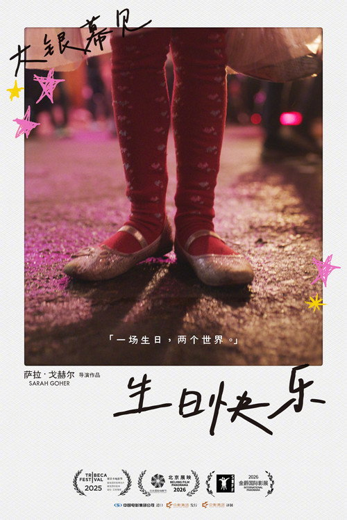
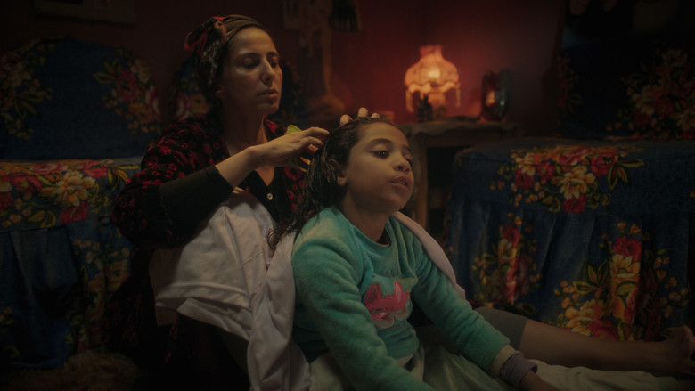
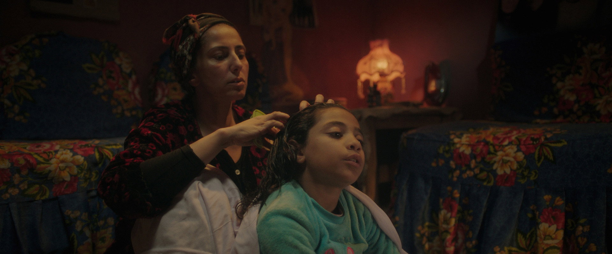

# 她没有自己的蜡烛

> **剧透预警**：本文涉及《生日快乐》的核心情节与结局。介意请先观影。

*《生日快乐》(عيد ميلاد سعيد / Happy Birthday, 2025) 官方海报*

---

## 一、一个不成立的片名

"生日快乐"。

这大概是世界上最常见的祝福语之一。你听到它的时候，通常意味着有人在庆祝你。有人为你点了一根蜡烛，有人希望你许愿，有人希望你被世界看见。

但《生日快乐》拍的，是一个永远不会收到这句话的人。

阿拉伯语原名 عيد ميلاد سعيد，拆开来看：عيد 是"节日"，ميلاد 是"出生"，سعيد 是"快乐"。字面意思是"出生节日快乐"——生日是一个节日。它是一个仪式。它的含义是"今天，全世界都停下来，承认你存在"。

但影片的主角托哈，八岁，在开罗一个富裕家庭当女仆——她没有这个节日。

她给主人的女儿奈莉过生日。买蛋糕，买气球，布置房间。她花了一整天，替另一个孩子完成了一场完美的生日派对。

然后她站在那场派对的角落里，看着蜡烛被点燃。

那不是她的蜡烛。

片名和影片内容之间存在一个根本性的矛盾。"生日快乐"是一句祝福，但影片的主角永远不会收到这句祝福。

你想想一个没有生日的人，她的世界是什么样的。她不会被庆祝，不会被记住，不会被看见。她的存在不被承认。在一个八岁女孩的世界里，这意味着什么？

这意味着她每天看着别人过生日，看着别人许愿，看着别人吹蜡烛，然后她走开。她知道自己不在那个仪式里。

这就是电影开始的地方。一个八岁的女孩，站在一个不属于她的生日派对里，看着蜡烛被点燃。

但这个矛盾不是标题党。这是一个关于"缺席的仪式"的电影。

你想想：生日是一个仪式，它的核心是"被承认"。今天，全世界停下来，承认你存在。今天，你是主角。今天，你是被祝福的那个人。

托哈连这个都没有。

一个连生日都没有的人，怎么可能有婚礼？怎么可能有葬礼？怎么可能有开学？怎么可能有毕业？

她连最基本的"被承认"都没有。

这就是为什么 Goher 选了生日。因为生日是一个你无法再简化了的仪式。它不能再小了。它就是一个蜡烛，一个愿望，一个"今天你被看见"的瞬间。

托哈把这个最小的仪式，偷了。

她站在别人的生日派对上，用一支笔，偷了一个属于她自己的瞬间。

她借了一句话，当成了自己的生日。她借了一支笔，当成了自己的工具。她借了一个房间，当成了自己的仪式。

她借了所有不属于她的东西，然后她把它们变成了自己的。

这就是这部电影最重的东西。

不是托哈没有生日。是托哈借了一个生日。

一个没有生日的人，借了一个生日。

*派对布置完成的房间，彩色气球和蛋糕*

---

## 二、为什么是生日派对

一个导演可以选择用一百种方式拍一个童工的故事。

她可以拍工厂。可以拍矿洞。可以拍一个八岁女孩在流水线旁边、在矿洞深处、在某个不该出现在那里的地方。她可以拍童工的悲惨、童工的残酷、童工的不公。

但 Sarah Goher 没有。

她拍了一个生日派对。

这是整部电影最勇敢的选择。因为生日派对和童工之间，表面上没有任何关系。一个生日派对是彩色的、快乐的、属于童年的。一个童工的故事是灰色的、悲惨的、属于社会的。这两个东西不应该出现在同一部电影里。

但它们确实出现了。

一部关于童工的电影，把镜头对准了一个生日派对。它没有拍她有多苦，它拍的是她有多小。它没有拍剥削，它拍的是一个女仆替另一个女仆过生日。它没有拍不公，它拍的是一个八岁的女孩，在别人的生日派对上，偷偷写下一个属于自己的愿望。

这就是整部电影的结构：用一个不属于托哈的仪式，去呈现托哈自己的存在。

你想想这个有多聪明。

如果 Goher 拍的是一个控诉片——工厂、矿洞、血汗——你会看完，会觉得难过，然后你会发一条微博，然后你会忘掉。因为控诉片给你的是愤怒，愤怒是一种消耗品，你用完了就没了。

但 Goher 拍了一个生日派对。你看完不会愤怒。你看完会坐在那里，坐很久。因为你发现，这部电影让你想起了一个很远的、很安静的、你几乎已经忘掉了的东西——那种"我也可以被庆祝"的感觉。

一个八岁的女仆，站在一个不属于她的生日派对里。

你为什么会想起那个感觉？

因为你自己也有过一次。

这就是这部电影最厉害的地方。它没有让你同情托哈，它让你想起了你自己。

一个导演最厉害的地方，是她没有拍什么。

Goher 没有拍工厂，没有拍矿洞，没有拍血汗。她拍了一个生日派对，拍了一个八岁的女孩站在蛋糕前面，拍了一支笔，拍了一张纸，拍了一个愿望。

然后它让你自己去想那些它没有拍的东西。

这就是这部电影最厉害的地方。它没有拍童工，但它拍了一个童工最不该被看见的脆弱——她没有生日。

而且它还做了一件更厉害的事：它让你自己去补全那些它没有拍的东西。

它没有拍工厂，但你看见了工厂。它没有拍血汗，但你看见了血汗。它没有拍那个父亲溺死的时候，但你知道了。它没有拍那个稻草人是怎么变成稻草人的，但你看见了田里的风。

这就是电影最厉害的地方。它不需要拍完所有的事。它只需要拍一个蛋糕，然后你自己在心里把剩下的东西填完。

一个八岁的女仆，在一个生日派对里，用一支笔写了一句话——这就是全部的暴力。你不需要看到工厂。你不需要看到血汗。你只需要看见这个八岁的女孩，用一支笔写了一句话，就足够了。

你想想这个结构有多精巧。它把一个复杂的社会问题——童工、阶级、父爱缺失——压缩进了一个最小的仪式里。这个仪式小到什么程度？小到一支笔，一张纸，一句话，一根蜡烛。

但就是在这个最小的仪式里，所有的重量都在。

你想想：为什么 Goher 选了生日，而不是婚礼？为什么不是葬礼？为什么不是开学？为什么不是毕业？

因为生日是最纯粹的仪式。婚礼是两个人的事。葬礼是所有人的事。开学是学校的事。毕业是未来的事。

但生日只是你自己的事。今天，全世界停下来，承认你存在。今天，你是主角。今天，你是被祝福的那个人。

托哈连这个都没有。

这就是为什么 Goher 选了生日。因为生日是一个你无法再简化了的仪式。它不能再小了。它就是一个蜡烛，一个愿望，一个"今天你被看见"的瞬间。

托哈把这个最小的仪式，偷了。

她站在别人的生日派对上，用一支笔，偷了一个属于她自己的瞬间。

你想想这件事。一个八岁的女孩，在别人的生日上，用一支笔，偷了一个属于她自己的瞬间。

她借了一句话，当成了自己的生日。她借了一支笔，当成了自己的工具。她借了一个房间，当成了自己的仪式。

她借了所有不属于她的东西，然后她把它们变成了自己的。

这就是这部电影最重的东西。

不是托哈没有生日。是托哈借了一个生日。

一个没有生日的人，借了一个生日。

---

## 三、十年之后拿起摄影机

现在说说拍这部片子的人。

Sarah Goher 不是那种"第一次拍电影就一鸣惊人"的新导演。她之前做了十年的制片——《678路公交车》、《碰撞》、《Amira》、《月光骑士》。

你注意这四部片子的名字。

《678路公交车》是开罗公交车上的阶级。《碰撞》是开罗小巴里的阶级。《Amira》是一个埃及女孩的故事。《月光骑士》是漫威的，但她在里面做的是制片顾问。

十年。四部片子。几乎每一部都在讲开罗的阶级。

她站在制片的位置上，看了十年。然后她终于拿起摄影机，拍了一个八岁的女仆。

这次和她合作的编剧 Mohamed Diab——就是《碰撞》的导演。他写了《生日快乐》，同时做了执行制片。

你想想这个路径。2010年，她在《678》的片场当制片人，看见公交车上的阶级。2016年，她在《碰撞》的片场当制片人，看见小巴里的阶级。2025年，她拿起摄影机，拍了一个八岁女孩站在生日蛋糕前面。

十年。三部片子。同一个阶级。从"制片位上看见"到"拿摄影机拍"。

你想想这件事有多难。一个制片人有十年时间看同样的问题，然后她终于决定自己拍。她没有把它拍成控诉——她拍成了一个生日派对。一个八岁女孩，一个愿望，一根不为自己点的蜡烛。

这是克制。这不是不会拍控诉片。这是看见了十年之后，选择不拍控诉片。

《碰撞》是一辆车里的人互相撕开。《生日快乐》是一个女仆在别人的生日派对上写了一个愿望。两部片子讲同一个阶级——但一个拍了撕开，一个写了句子。

然后说说 Doha Ramadan。

国外影评几乎一边倒地夸她。有评论说她"从八岁小孩身上逼出了惊人的深度"，说她在这个角色里是"绝对的奇迹"，"不像多数童星那样用力过猛，她有一张表情极其丰富的脸，她不会被任何人糊弄"。

我同意。

托哈这个角色的难处在于：她不能哭，不能喊，不能演。一个八岁的女仆，要演的不是"我很惨"，是"我早就知道了"。

八岁的小孩，如果真的"早就知道了"，她不会哭。她会站在蜡烛前面，停一下，然后走开。

Doha Ramadan 没有演哭，没有演喊，没有演"我有多惨"。她演的是"我知道"。

这是最难的东西。一个八岁的小孩的眼睛里，装着一整个她已经放弃的期待。

一个真正放弃过的小孩，不会表演放弃。她已经不需要表演了。因为她早就知道了。她只需要站在那里。

有评论说 Sarah Goher"逼出了"这个表演。但我觉得用词不对——不是"逼"，是"等"。Sarah Goher 在片场等了她。她什么都没做，就让这个八岁的小孩站在那里，然后拍了下去。

一部电影最难的表演，往往不是那个最激烈的瞬间，而是那个最安静的瞬间。

你想想：如果 Goher 拍的是一个控诉片，她会让这个八岁的女孩哭，会让她喊，会让她演出"我有多惨"。但 Goher 没有。她让这个八岁的女孩站在那里，安静地站着。

这就是克制。

一个制片人做了十年阶级片，然后第一次拿摄影机，她没有拍成控诉。她拍成了一个生日派对。

这就是这部电影最厉害的地方。它不是不会拍愤怒，它是看见了愤怒之后，选择了不拍。

你想想这个路径有多长。

2010年，Sarah Goher 在《678路公交车》的片场当制片人。她看见公交车上的阶级。她看见司机，看见乘客，看见那些在公交车上相遇又分开的人。她看见开罗的阶级。

2016年，她在《碰撞》的片场当制片人。她看见小巴里的阶级。她看见那些在意外中相遇的人，看见他们在一天之内互相撕开。她看见开罗的阶级。

2021年，她做了《Amira》的总制片人。2022年，她做了《月光骑士》的制片顾问。

十年。每一部片子都在讲同一个东西：开罗的阶级。

然后2025年，她拿起摄影机，拍了一个八岁的女孩。

她拍的是一个女仆。一个没有生日的女仆。一个在别人的生日派对上写了一个愿望的女仆。

这就是十年的积累。不是技巧，不是方法，是看见。

一个制片人做了十年，她看见了同一个阶级。然后她终于决定自己拍。她没有拍成控诉——她拍成了一个生日派对。

这就是这部电影的底色。它不是突然出现的灵感，它是十年之后才拿起的摄影机。

*Doha Ramadan 饰 托哈*

---

## 四、蜡烛没有灭

整部电影最重要的一个动作，出现在结尾。

轮到托哈过生日了。她站在自己的蛋糕前面，停了一瞬——然后她没有吹。

豆瓣有一条短评写得很精准："最终终于在蜡烛熄灭的那一刻，梦碎心。"

这条短评说错了。蜡烛没有熄灭。是托哈没有吹灭它。

但这条短评比大多数评论都更接近了这部电影的核心。因为"蜡烛熄灭的那一刻"——那正是托哈决定"不吹"的那一刻。

**一个八岁的孩子，为什么不吹蜡烛？**

因为许愿改变不了什么。

托哈早就知道了。她知道许愿不能让爸爸回来。不能让爸爸从田里的稻草人变回一个活人，重新走进这个家，重新叫她一声。不能让她的生日从这个家里浮现出来。不能让莱拉看她的眼神，从"女仆"变成"孩子"。

**许愿，不就是想改变那些我们自己都无法控制的事情吗？**

一个八岁的小孩，比大人都更早接受了这件事。她知道那些愿望，一个都不会实现。所以她没吹。不是不想过生日——是她已经知道了。

一个八岁的孩子，站在自己的蜡烛前面，选择不去吹灭它。因为吹灭就意味着许愿，许愿就意味着期待，期待就意味着要失望。而她不愿意。她已经不需要了。

这不是一种坚强。这是一种提前到来的放弃。

一个八岁的小孩，在生日那天，放弃了许愿的权利。

你想想这意味着什么。吹蜡烛是一个仪式——你闭上眼睛，你许愿，你吹灭它，然后蜡烛灭了，愿望被送出去了。整个仪式都在告诉你：愿望有可能实现。

托哈拒绝了这个仪式。

她不是不信愿望能实现。她知道愿望不可能实现。所以她拒绝了这个让她产生期待的仪式。

一个八岁的女孩，用"不吹蜡烛"的方式，把自己保护起来了。

这比哭比喊比控诉都重。一个大人不会这样。一个大人会吹灭蜡烛，然后假装什么都不知道。一个八岁的孩子不会。她已经知道了。

而且你注意：蜡烛没有灭。

蜡烛还在那里烧着。托哈站在那根没有吹灭的蜡烛前面。火苗还在跳。烟雾还在升。但没有人吹灭它。

这是一个多么安静的画面。一根蜡烛在烧，一个人站在那里，不说话，不吹，不许愿。

蜡烛在等。等一个人吹灭它。但那个人没有来。

不是她不想来。是她知道了。她知道吹灭蜡烛不会改变什么。

你想想这个动作的重量。一个八岁的孩子，在生日那天，主动拒绝了一个仪式。这不是"不想过生日"——这是"知道过了也没用"。

许愿是一个关于希望的仪式。你闭上眼睛，你想一个你不可能拥有的东西，然后你吹灭蜡烛，你相信这个世界会回应你。

托哈知道这个世界不会回应她。

她知道吹灭蜡烛不会让稻草人变成爸爸。她知道吹灭蜡烛不会让她的生日从那个家里浮现。她知道吹灭蜡烛不会让莱拉看她的眼神从"女仆"变成"孩子"。

所以她拒绝了这个仪式。

一个八岁的女孩，用"不吹蜡烛"的方式，拒绝了整个成人世界的许愿逻辑。

你想想一个八岁的女孩，站在田边，看着一个稻草人。她知道那不是她爸爸。她也知道那是她爸爸。这两个"知道"同时存在，而且每天都在存在。

这就是电影没有拍出来的东西。不是父亲死了。不是父亲变成了稻草人。是那个"知道"——那个每天都在发生的、安静的、持续的丧失。

电影没有拍这个丧失。电影只是让这个稻草人站在那里。然后它让你自己去感受。

你想想一个八岁的女孩，失去了父亲。正常来说，一部电影会拍她大哭、拍她喊爸爸、拍她追着妈妈要爸爸。但《生日快乐》没有。它只是把一个稻草人放在那里。

因为对一个八岁的孩子来说，失去父亲不是一次事件。失去父亲是一个状态。你不需要大哭一次。你只需要每天经过那个稻草人的时候，看见它，然后知道那不是你的爸爸，但又知道那是你的爸爸。

这个"知道"每天都在发生。它不是一次性的事件，它是一个持续的、安静的、每天都在发生的丧失。

电影没有拍这个丧失。电影只是让这个稻草人站在那里。然后它让你自己去感受。

一个稻草人站在田里。风一吹，它晃一下。它什么都不会说。它什么都不会做。它只是站在那里。

但一个八岁的女孩每天看着它，都知道了。

她不需要别人告诉她父亲死了。她不需要别人跟她解释什么是死亡。她不需要别人拍一场葬礼给她看。

她只需要每天经过那个田，看见那个稻草人，然后知道——那不是爸爸，但那是爸爸。

这就是电影最克制的地方。它没有拍死亡。它拍的是死亡之后的每一天。

那个稻草人就在那里。它每天都在那里。风一吹，它晃一下。它什么都不会做。它什么都不会说。

但一个八岁的女孩每天看着它，都知道了。

这就是整部电影最重的东西。

一个八岁的女孩，站在蜡烛前面，停了一瞬，然后没有吹。

这不是一个高潮。这是一个安静的瞬间。

但这个安静的瞬间比任何一场控诉都重。

你想想：电影没有拍托哈的愤怒，没有拍她的控诉，没有拍她的眼泪。它只拍了她站在蜡烛前面，停了一瞬，然后没有吹。

这就是全部的重量。

一支笔，一张纸，一句话，一根蜡烛，一个没有吹灭的动作。

这就是整部电影给你的。

*开罗城郊，田野间的稻草人*

---

## 五、你坐在黑暗里

影片结束了。灯亮了。字幕出来了。

但你坐着没有动。

因为有一件事还没有发生。

有一个瞬间，在字幕滚动的时候，在你起身之前的那几秒钟——你坐在黑暗里，那个八岁女孩站在蜡烛前面，没有吹灭它。

然后字幕出来了。然后灯亮了。但那个瞬间还在。

它没有结束。因为你没有替她说出来。

你坐在黑暗里，你知道你想说什么。你知道你想对银幕上那个八岁的女孩说什么。但你没有说。因为银幕上没有人回应。因为灯亮了。

你站起来，走出影院。走到门口。站在门外。

你终于可以说了。

你不需要说出来。你只需要站在那里。和那个八岁的女孩一样。

她站在蜡烛前面，停了一瞬，然后没有吹。

你站在影院门口，停了一瞬，然后没有说。

这就是整部电影给你的。一个没有说出来的瞬间。

一部电影最厉害的时刻，不是让你哭，也不是让你笑。是让你在黑暗里，不知道该干什么。

你坐在黑暗里，看着一个八岁的女孩拒绝了你整个成人世界的逻辑。她不需要你的安慰。她不需要你的祝福。她甚至不需要你替她吹灭蜡烛。

她只需要站在那里。

而你——你坐在黑暗里，不知道该说什么。

这不是电影的失败。这是电影的胜利。它让你在黑暗里坐了很久，不知道该干什么。

一部电影最厉害的时刻，就是让你在黑暗里，不知道该干什么。

你坐在黑暗里，看着一个八岁的女孩，用一支笔写了一句话，然后没有吹灭蜡烛。

你发什么朋友圈？

"刚看了一部埃及电影，一个八岁女孩没有吹灭蜡烛"？

这不是朋友圈。这是你在黑暗里坐了九十分钟之后，站在门口，不知道该说什么。

这就是这部电影给你的。不是感动，不是愤怒，不是共鸣。是一种"不知道该说什么"的状态。

一部好的电影不是把话说出来，是把话咽回去。《生日快乐》把话咽回去了。然后它也让你把话咽回去了。

那个瞬间不需要语言。那个瞬间只需要坐着。

---

## 影片信息

| | |
|---|---|
| 片名 | 生日快乐 / عيد ميلاد سعيد / Happy Birthday |
| 导演/编剧 | Sarah Goher（长片首作）、Mohamed Diab |
| 主演 | Doha Ramadan（托哈）、Nelly Karim（莱拉）、Khadheeja Ahmed（奈莉） |
| 语言 | 阿拉伯语（埃及） |
| 片长 | 92 分钟 |
| 上映 | 2025年（埃及）/ 2026-10-23（中国大陆） |
| 烂番茄 | 100% |
| 豆瓣 | 8.8 |
| 提名 | 第 16 届好莱坞音乐媒体奖·外语独立电影原创配乐（Mina Samy） |

---

*本文为二十四帧原创影评，转载请注明出处。*

## 关联
- [[0_素材库_生日快乐]]
- [[影评评分记录]]
- [[film-review-writing]]